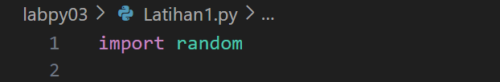
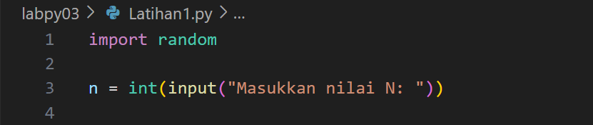
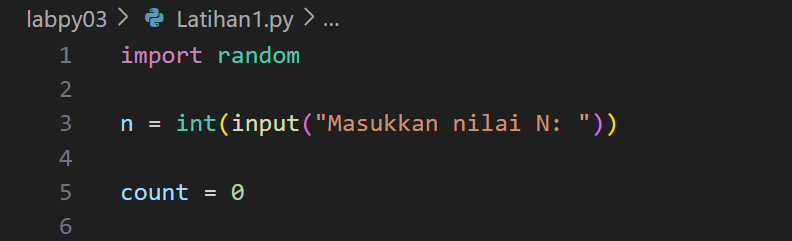
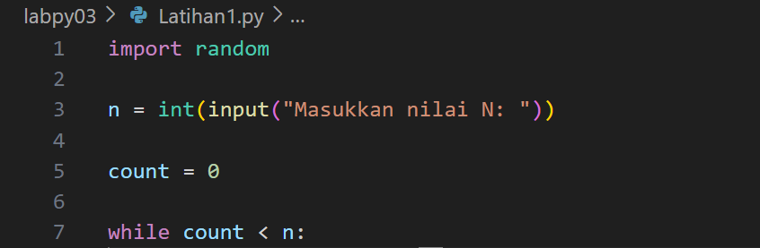
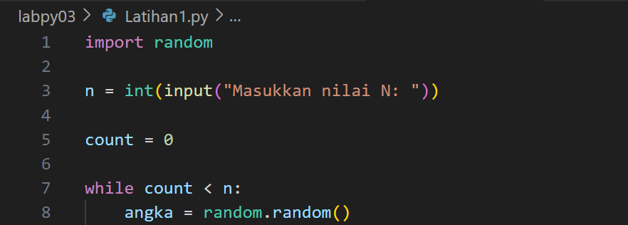
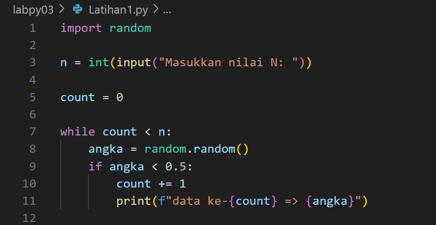
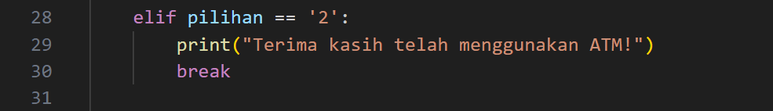
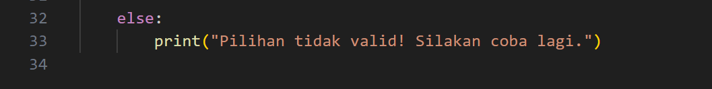

# Laporan Pratikum 4
Dalam perulangan bahasa pemrograman merupakan suatu pernyataan untuk
menginstruksi komputer agar melakukan sesuatu secara berulang.
Terdapat dua jenis perulangan dalam bahasa pemrograman python, yaitu perulangan
dengan for dan while.

## Latihan 1
Berikut langkah langkah alur algoritma 

### Step 1 : Mengimpor Library
Masukkan Program 'input random' yang diperlukan untuk menghasilkan bilangan acak antara 0 dan 1

### Step 2 : Meminta Input dari Pengguna
Kemudian Pengguna diminta memasukkan nilai n yaitu jumlah bilangan acak yang ingin ditampilkan.

### Step 3 : Inisialisasi Variabel Counter
Selanjutnya masukkan perintah 'count' yang diinisialisasi dengan nilai 0. Variabel ini digunakan untuk menghitung berapa banyak bilangan acak yang sudah memenuhi syarat (bilangan < 0.5).

### Step 4 : Perulangan While
Kemudian masukkan perintah while yang akan berjalan selama nilai 'count' masih lebih kecil dari n. Artinya,program akan terus mencari dan mencetak bilangan acak sampai sebanyak n bilangan acak yang memenuhi syarat ditemukan.

### Step 5 : Menghasilkan Bilangan Acak
Dalam setiap iterasi perulangan, program menghasilkan satu bilangan acak antara 0 dan 1 dengan menggunakan perintah 'random.random()'.

### Step 6 : Pengecekan Bilangan Acak:
Jika bilangan acak yang dihasilkan lebih kecil dari 0.5, maka Counter (count) akan bertambah 1 dan Bilangan tersebut akan ditampilkan di layar.

### Step 7 :Menampilkan Pesan
Setelah semua bilangan acak yang memenuhi syarat ditampilkan, program keluar dari perulangan dan menampilkan pesan 'Selesai'

## Kesimpulan
Kode ini berfungsi untuk menghasilkan angka acak dan mencetak angka yang kurang dari 0.5 hingga jumlah angka yang dicetak mencapai nilai yang ditentukan oleh pengguna (N). Dengan menggunakan loop dan kondisi, kode ini memungkinkan pengguna untuk mendapatkan hasil yang bervariasi setiap kali program dijalankan, tergantung pada angka acak yang dihasilkan.

## Latihan 2
Berikut langkah-langkah alur algoritma

### Step 1 : Inisialisasi Modal Awal
Masukkan perintah 'modal awal' pengusaha, yaitu 100 juta, yang akan digunakan untuk menghitung laba setiap bulannya

### Step 2 : Daftar Persentase Laba Per Bulan
Kemudian Masukkan Input dalam sebuah list 'laba_persen' yang berisi persentase laba untuk setiap bulan

### Step 3 : Inisialisasi Variabel Total Laba
Masukkan Variabel 'total_laba' dengan ini total laba dapat diperoleh selama 8 bulan. Dimulai dari 0.

### Step 4 : Menghitung Laba Setiap Bulan
-Jika bulan sedang belajar laba_persen[bulan] adalah 0, sehingga laba_bulan
-Jika bulan adalah 2 atau 3 (bulan ketiga dan keempat), laba_persen[bulan] adalah 0.01, sehingga laba_bulan alias 100000000 * 0.01 = 1000000.0.
-Jika total_laba adalah variabel yang menyimpan akumulasi laba dari bulan ke bulan.Maka laba_bulan,mendapatkan total laba hingga bulan tersebut.
-Jika laba bulan digunakan untuk bulan ke 1 layar.maka f-string akan muncul format output:
bulan + 1: Menghitung bulan yang lebih manusiawi (1 hingga 8) dari indeks (0 hingga 7).
laba_bulan: Menampilkan jumlah laba untuk bulan tersebut.

### Step 5 :  Menampilkan Total Laba
Dengan tahap ini total laba menampilkan hasil setelah dihitung dari bulan pertama hingga bulan kedelapan.

## Kesimpulan
Kode ini berfungsi untuk menghitung dan menampilkan laba yang diperoleh dari investasi modal awal selama 8 bulan berdasarkan persentase laba yang ditentukan. Kode ini melakukan perhitungan sederhana dalam sebuah loop dan menampilkan hasil untuk setiap bulan serta total laba di akhir. Dengan menggunakan struktur data list untuk menyimpan persentase laba, kode ini menjadi mudah untuk dimodifikasi jika diperlukan persentase yang berbeda di masa depan.

## Latihan 3
Berikut langkah langkah alur algoritma 

### Step 1 : Inisialisasi Saldo
Masukkan saldo yang anda inginkan dalam tahap pertama 

### Step 2 : Menampilkan fungsi tampilan menu
Dalam Tahap ini saldo menampilkan menu pilihan kepada pengguna. Ketika fungsi ini dipanggil, pengguna akan melihat saldo dan opsi untuk menarik uang atau keluar dari program.

### Step 3 : Loop Utama
Selanjutnya masukkan perintah 'while True' program ini akan terus berjalan dan menampilkan menu hingga pengguna memilih untuk keluar. tampilkan_menu() dipanggil untuk menunjukkan informasi kepada pengguna.

### Step 4 : Pemrosesan Pilihan
Kemudian pengguna diminta untuk memasukkan jumlah uang yang ingin ditarik
*Jika jumlah yang diminta lebih besar dari saldo, program akan memberi tahu bahwa saldo tidak cukup.
*Jika jumlah yang diminta kurang dari atau sama dengan 0, program akan memberi tahu bahwa jumlah penarikan tidak valid.
*Jika jumlah valid, saldo akan dikurangi dengan jumlah yang ditarik, dan program akan mencetak pesan bahwa penarikan berhasil.
*Jika input bukan angka (misalnya, huruf), akan muncul pesan kesalahan yang meminta pengguna memasukkan angka.

### Step 5 : Keluar dari Program
lalu pengguna diminta memilih opsi 2,program ini akan mencetak pesan terima kasih dan keluar dari loop, mengakhiri program.

### Step 6 : Pilihan Tidak Valid:
Jika pengguna memasukkan pilihan yang tidak valid (bukan 1 atau 2), program akan memberi tahu pengguna bahwa pilihan yang dimasukkan tidak valid dan akan meminta mereka untuk mencoba lagi.

## Kesimpulan
Kode ini merupakan implementasi sederhana dari sistem penarikan uang melalui ATM. Program terus berjalan hingga pengguna memilih untuk keluar, dan memiliki validasi untuk memastikan penarikan uang dilakukan dengan benar dan sesuai dengan saldo yang ada.
